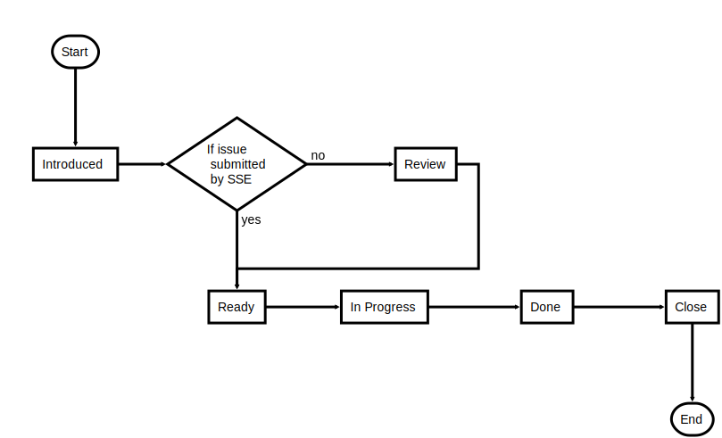

# Security Issue Life Cycle

Every team needs to deal with security issue, but you might wonder how these security issues need to be added to issue tracking systems, how to treat them, how long let them stick around, how to decide about their severity and who owns them. This document is trying to generate a blueprint to define security issue life cycle in your project.

- What is security issue?

    Any software bug that introduce vulnerability to the system is considered security issue.

- Actors
    - Security engineer
    - Architect
    - Developer
    - Product/Project Manager
    - Test engineer
    - Support

## Security Issue Workflow

Security issue life is going to start from the discovery of the issue, which will be introduced to the system, review by an expert, ready to assign to developer, in progress of rectifying the issue and done. At the end an expert need to verify the fix.

- Introduce
- Review
- Ready
- In progress
- Done
- Verify
- Close

**Introduce**

A security issue can be found in different phases of software development life cycle:

1. Design
2. Implementation
3. Testing and integration
4. Maintenance

*Design, Implementation, Testing and integration*

> I have grouped these phases since the software has not delivered yet to customer.

Your team might use issue tracking system as task management too, in this case you might end up having security issue listed as task/requirement during design and implementation phase so that developer, security engineer and product manger can track those tasks.

During testing and integration phase, security engineer or test engineer might find new security issue and add them to the system.

*Maintenance*

> Most important phase

After delivering the software, your customer or any external party might find security issue. If your issue tracking system is not public, probably your support team need to add these issues to the system.

**Review**

If issue is introduced during maintenance phase, your system need to send notification to product manager, architect and security engineer. Security engineer need to validate security issue and with help of product manger and architect rate issue's severity, and make the issue ready for respective developer.

**Ready**

When issue is ready to be picked by developer.

**In progress**

When work on issue is in progress.

**Done**

When work is done and the fix for the issue is ready.

**Verify**

In this stage, security engineer or if possible test engineer need to verify the fix and close the issue.

**Close**

Closed issue access can be changed to public after 6 months automatically, or in the case that customer has not update/is not able to update to latest version you might want to keep it private.

## Security Issue Access

- Private
    - Security open security issue must be private and only accessible by Product manager, Architect, Security engineer and the respective component developer and test engineer.
- Public
    - Security issue can be accessible by everyone if and only if it resolved and have closed status.

## Miscellaneous

- In which version you need to apply the fix?

	All active versions should be patched with the fix.

- Security issue vs Security feature

	Do not mix security issue and security feature in your issue tracking system. They should be treated differently.
